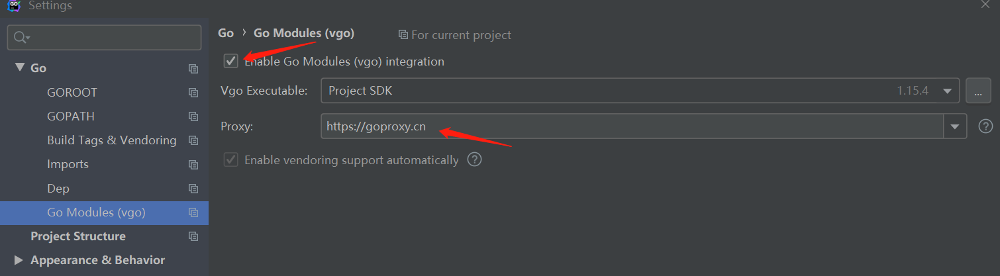

# 仿小米商城后端服务
## 介绍

模拟小米官网的后端服务

项目运行环境

| go          | 1.15+   |
| ------------ | ------ |
| mysql        | 5.7+   |
| redis        | 6.2.1  |
| beego        | 2.0.1  |


## 代码结构说明

```
mi-beego

——conf      #相关目启动位置，包含启动端口、mysql、redis  配置

——controller   #接口控制层

——models   #实体层和db 的 crud

——pkg   #通用组件

——routers    #路由，接口请求先到达routers 再到对应的controller

——swagger   #在线接口文档

——tests   #单元测试

——third_part    #第三方组件 例如 swagger
```

## 后端启动

[代码地址Gitee](https://gitee.com/gitxys/mi_beego)

[代码地址GitHub](https://github.com/xuyisu/mi_beego)

###### 1.先下载代码

###### 2.配置代理



###### 3.下载依赖组件

```
go mod download
```

###### 4.将doc 下面的mi-mall.sql 导入到mysql数据库,同时  启动mysql  和 redis

**后端运行先配置数据库（mysql 和redis）**

```
#应用名称
appname = mi-beego
#端口
httpport = 8081
#运行环境
runmode = dev
#是否模板自动渲染，默认值为 true，对于 API 类型的应用，应用需要把该选项设置为 false，不需要渲染模板
autorender = false
#是否允许在 HTTP 请求时，返回原始请求体数据字节，默认为 false 
copyrequestbody = true
#开启swagger
EnableDocs = true
#数据库链接
sqlconn = root:123456@tcp(127.0.0.1:3306)/mi-mall-go
#redis 配置
redis_key = default
redis_conn = 127.0.0.1:6379
redis_dbNum = 0
redis_password = 123456
redis_maxIdle = 10
redis_maxActive = 10
redis_timeout = 160s
#session 过期时间(秒钟)
session_expire= 3600
```

###### 5.启动

切到命令行窗口，并输入 `bee run`，看到以下结果即代表启动成功

```
______
| ___ \
| |_/ /  ___   ___
| ___ \ / _ \ / _ \
| |_/ /|  __/|  __/
\____/  \___| \___| v2.0.2
2021/12/30 10:17:54 WARN     ▶ 0001 Running application outside of GOPATH
2021/12/30 10:17:54 INFO     ▶ 0002 Using 'mi-beego' as 'appname'
2021/12/30 10:17:54 INFO     ▶ 0003 Initializing watcher...
mi-beego/pkg/utils
mi-beego/pkg/lib
mi-beego/pkg/log
mi-beego/third_party/mysql
mi-beego/third_party/swagger
mi-beego/third_party/redis
mi-beego/models
mi-beego/pkg/filter
mi-beego/controllers
mi-beego/routers
mi-beego
2021/12/30 10:17:58 SUCCESS  ▶ 0004 Built Successfully!
2021/12/30 10:17:58 INFO     ▶ 0005 Restarting 'mi-beego.exe'...
2021/12/30 10:17:58 SUCCESS  ▶ 0006 './mi-beego.exe' is running...
2021/12/30 10:17:58.768 [I] [parser.go:85]  D:\workspaces\mywork\gitee\mi-beego\controllers no changed

2021/12/30 10:17:58.769 [I] [server.go:241]  http server Running on http://:8081

```

浏览器输入 http://127.0.0.1:8081/swagger


## 其他语言后端地址

| 名称                       | Gitee                                      | Github                                      |
| -------------------------- | ------------------------------------------ | ------------------------------------------- |
| mi_springboot (Java)       | https://gitee.com/gitxys/mi_springboot     | https://github.com/xuyisu/mi_springboot     |
| mi-beego (Golang)          | https://gitee.com/gitxys/mi-beego          | https://github.com/xuyisu/mi-beego          |
| mi-gin (Golang)            | https://gitee.com/gitxys/mi-gin            | https://github.com/xuyisu/mi-gin            |
| mi_django (Python)         | https://gitee.com/gitxys/mi_django         | https://github.com/xuyisu/mi_django         |
| mi_fastapi (Python)        | https://gitee.com/gitxys/mi_fastapi        | https://github.com/xuyisu/mi_fastapi        |
| mi_koa_nodejs (nodejs)     | https://gitee.com/gitxys/mi_koa_nodejs     | https://github.com/xuyisu/mi_koa_nodejs     |
| mi_express_nodejs (nodejs) | https://gitee.com/gitxys/mi_express_nodejs | https://github.com/xuyisu/mi_express_nodejs |
| mi_egg_nodejs (nodejs)     | https://gitee.com/gitxys/mi_egg_nodejs     | https://github.com/xuyisu/mi_egg_nodejs     |
|                            |                                            |                                             |


## 前端启动

项目地址https://gitee.com/gitxys/mi_vue

[代码地址Gitee](https://gitee.com/gitxys/mi_vue)

[代码地址GitHub](https://github.com/xuyisu/mi_vue)

1.下载代码到本地

2. 控制台先安装依赖包

```
npm install 
```

3.启动

```
npm run serve
```

## 页面介绍

浏览器输入http://localhost:8080 将看到一下页面


登录:**用户名/密码**  admin/123456


购物车


订单确认


订单结算(彩蛋！！！！   这里的结算做了特殊处理)


订单列表


亲，留个star 吧
